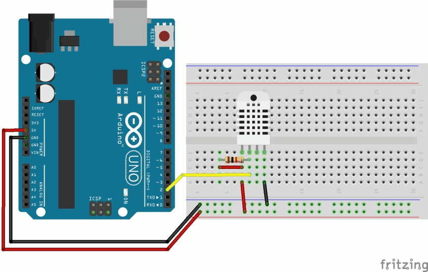

# uuIOT official repository

## The team

- Jaroslav Huss
- Jan Vojáček
- Róbert Kuzma
- Lukáš Bříza
- Jiří Hejtmánek
- Alan Kováč

## How to prepare your environment for the local development

1. sudo npm install -g typescript
2. cd server && npm install
3. touch .env
4. cd ..
5. cd client && npm install

## In server/.env file few lines must be saved

DB_LOCAL = mongodb://127.0.0.1:27017/iot \
DB_PRODUCTION = this string is provided by Honza or Jarda \
DEV_MODE = This is ENUM type development|production \
JWT_SECRET = JWT secret - Jarda can provide it \
JWT_EXPIRE = 60min
TEST = false
## How to run whole dev environment with one command (FE and BE)

cd server && npm run dev
## Weather station schema

